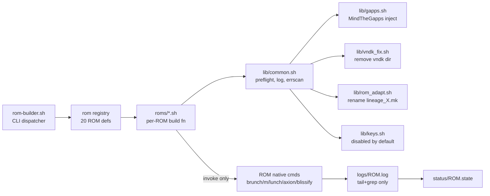

Below is a modular, maintainable build framework for all 20 ROMs targeting the itel VistaTab 30 Pro (`P13001L`). It enforces sequential builds, per-ROM logs, the `libbinder-v32` VNDK fix, GApps injection, ROM-name tree adaptation, and a pre-flight check — all without touching the ROM's own build system (only the device tree is ever edited, per your constraint). Signing is **disabled by default** as requested.

## Architecture



The framework **only calls the ROM's native build commands** and **only edits `device/itel/P13001L/`** — nothing is injected into `build/`, `soong/`, or vendor trees, so there is zero overhead to the build system itself.

## Directory layout

```
rom-builder/
├── rom-builder.sh              # CLI entrypoint
├── config/
│   ├── device.conf             # device + workspace settings
│   └── flags.conf              # per-ROM .mk flag appends
├── lib/
│   ├── common.sh               # preflight, logging, error scan, device-tree patch
│   ├── gapps.sh                # MindTheGapps clone + inherit-product line
│   ├── vndk_fix.sh             # libbinder-v32 conflict resolution
│   ├── rom_adapt.sh            # lineage_X.mk → rom_X.mk rename + config path rewrite
│   └── keys.sh                 # key generation (DISABLED this session)
├── roms/                       # one file per ROM
│   ├── _template.sh
│   ├── lineage.sh  axion.sh  evolution.sh  derpfest.sh  lumine.sh
│   ├── voltage.sh  alphadroid.sh  matrixx.sh  lunaris.sh  bliss.sh
│   ├── avium.sh  mist.sh  pixelos.sh  genesis.sh  clover.sh
│   ├── yaap.sh  halcyon.sh  infinity.sh  crdroid.sh  superior.sh
├── logs/                       # <rom>.log  (tail only, never full)
└── status/                     # <rom>.state  (PENDING|SYNCED|BUILT|FAILED)
```

## config/device.conf

```bash
# device.conf — edit once, shared by every ROM
export DEVICE="P13001L"
export VENDOR="itel"
export DEVICE_TREE="device/itel/P13001L"
export CODENAME Pretty="VistaTab 30 Pro"
export WORKDIR="${WORKDIR:-$HOME/android}"
export LOCAL_MANIFEST="https://github.com/ardiandideyashidiq/local_manifest-P13001L"
export LOCAL_MANIFEST_DIR=".repo/local_manifests"
export SYNC_JOBS="${SYNC_JOBS:-$(nproc)}"
export BUILD_JOBS="${BUILD_JOBS:-$(nproc)}"
export MIN_DISK_GB=350
export MIN_RAM_GB=48
export ENABLE_SIGNING=0          # disabled — signing is broken this session
export ENABLE_GAPPS_AUTO=1       # auto-inject MindTheGapps for ROMs without GApps
```

## lib/common.sh

```bash
#!/usr/bin/env bash
# common.sh — shared helpers. Sourced, never executed directly.
set -uo pipefail

RED='\033[0;31m'; GRN='\033[0;32m'; YLW='\033[1;33m'; CYN='\033[0;36m'; NC='\033[0m'
log()  { printf "${CYN}[$(date +%H:%M:%S)]${NC} $*\n"; }
ok()   { printf "${GRN}[$(date +%H:%M:%S)] OK${NC} $*\n"; }
warn() { printf "${YLW}[$(date +%H:%M:%S)] WARN${NC} $*\n"; }
err()  { printf "${RED}[$(date +%H:%M:%S)] ERR${NC} $*\n"; }

# ---------- preflight ----------
preflight() {
  command -v repo >/dev/null   || { err "repo not installed";  return 1; }
  command -v git  >/dev/null   || { err "git not installed";   return 1; }
  local ram_kb=$(awk '/MemTotal/{print $2}' /proc/meminfo)
  local ram_gb=$((ram_kb/1024/1024))
  local disk_gb=$(df -BG --output=avail "${WORKDIR:-$HOME}" | tail -1 | tr -dc '0-9')
  [[ $ram_gb  -ge $MIN_RAM_GB  ]] || warn "RAM ${ram_gb}GB < recommended ${MIN_RAM_GB}GB — expect OOM"
  [[ $disk_gb -ge $MIN_DISK_GB ]] || { err "disk ${disk_gb}GB < ${MIN_DISK_GB}GB required"; return 1; }
  ok "preflight: ram=${ram_gb}GB disk=${disk_gb}GB jobs=${BUILD_JOBS}"
}

# ---------- per-ROM workspace ----------
rom_root() { echo "${WORKDIR}/${1}"; }             # e.g. ~/android/lineage

# ---------- local manifest ----------
inject_local_manifest() {
  local rom="$1" root; root=$(rom_root "$rom")
  mkdir -p "$root/$LOCAL_MANIFEST_DIR"
  [[ -d "$root/$LOCAL_MANIFEST_DIR/.git" ]] && return 0
  git clone "$LOCAL_MANIFEST" "$root/$LOCAL_MANIFEST_DIR" || { err "local_manifest clone failed"; return 1; }
}

# ---------- sync ----------
do_sync() {
  local rom="$1" root; root=$(rom_root "$rom")
  cd "$root" || return 1
  repo sync -c -j"$SYNC_JOBS" --force-sync --no-clone-bundle --no-tags 2>&1 | tail -40
  set_state "$rom" "SYNCED"
}

# ---------- logging / error scan ----------
# Never pipe the full build log — only tail + grep for FAILED/error.
LOGDIR="${LOGDIR:-$PWD/logs}"; mkdir -p "$LOGDIR"
STATUSDIR="${STATUSDIR:-$PWD/status}"; mkdir -p "$STATUSDIR"
rom_log()      { echo "$LOGDIR/$1.log"; }
set_state()    { echo "$2" > "$STATUSDIR/$1.state"; }
get_state()    { cat "$STATUSDIR/$1.state" 2>/dev/null || echo "PENDING"; }

# scan_log <rom>  — prints only the actionable failure lines
scan_log() {
  local log; log=$(rom_log "$1")
  [[ -f "$log" ]] || return 0
  # first FAILED: line is the real cause; ninja reports it last but cause is earlier
  grep -nE "FAILED:|^error:|error: |Error:|No rule to make target|already defined|No space left|OutOfMemoryError" "$log" \
    | head -25 || true
}

# ---------- device-tree patch (the ONLY tree we may edit) ----------
# Append lines to the device .mk if not already present.
patch_mk() {
  local rom="$1" mkfile="$2"; shift 2
  local root; root=$(rom_root "$rom")
  local f="$root/$DEVICE_TREE/$mkfile"
  [[ -f "$f" ]] || { warn "$mkfile not found in device tree"; return 0; }
  while [[ $# -gt 0 ]]; do
    grep -qF "$1" "$f" || echo "$1" >> "$f"
    shift
  done
}

# Append lines to system.prop
patch_prop() {
  local rom="$1"; shift
  local root; root=$(rom_root "$rom")
  local f="$root/$DEVICE_TREE/system.prop"
  touch "$f"
  while [[ $# -gt 0 ]]; do
    grep -qF "$1" "$f" || echo "$1" >> "$f"
    shift
  done
}
```

## lib/vndk_fix.sh — the `libbinder-v32` error

```bash
#!/usr/bin/env bash
# vndk_fix.sh — resolves:
#   build/make/core/base_rules.mk:320: error: device/itel/P13001L/vndk:
#   MODULE.TARGET.SHARED_LIBRARIES.libbinder-v32 already defined by
#   hardware/lineage/compat.
# Cause: the device tree ships a vndk/ dir that duplicates the VNDK shims
# already provided by hardware/lineage/compat (or the ROM's equivalent).
# Fix: remove the vndk dir from the DEVICE TREE ONLY (never the vendor tree).
source "${BASH_SOURCE[0]%/*}/common.sh"

vndk_fix() {
  local rom="$1" root; root=$(rom_root "$rom")
  local vndk="$root/$DEVICE_TREE/vndk"
  if [[ -d "$vndk" ]]; then
    warn "removing conflicting $DEVICE_TREE/vndk (libbinder-v32 already defined by lineage/compat)"
    rm -rf "$vndk"
    ok "vndk dir removed — rebuild should pass VNDK packaging"
  fi
}

# Auto-detect: scan last build log for the conflict and fix if seen
vndk_fix_if_needed() {
  local rom="$1" log; log=$(rom_log "$rom")
  if grep -q "libbinder-v32 already defined by hardware/lineage/compat" "$log" 2>/dev/null; then
    vndk_fix "$rom"
    return 0   # signal: a fix was applied, caller should re-run installclean + build
  fi
  return 1
}
```

The root cause is that the device tree bundles VNDK shims (e.g. `libbinder-v32.so`) under `device/itel/P13001L/vndk/`, which collide with the same libraries already shipped by the ROM's `hardware/lineage/compat` module — so removing the device-tree copy is the correct, minimal fix.【turn2search26】

## lib/gapps.sh — GApps for ROMs that don't bundle them

```bash
#!/usr/bin/env bash
source "${BASH_SOURCE[0]%/*}/common.sh"

# ROMs that already include GApps natively — skip injection for these.
GAPPS_NATIVE_RE="axion|evolution|derpfest|matrixx|bliss|avium|alphadroid|pixelos|clover|halcyon|infinity|mist|lumine|genesis"

rom_has_gapps() { [[ "$1" =~ ^($GAPPS_NATIVE_RE)$ ]]; }

inject_gapps() {
  local rom="$1" root; root=$(rom_root "$rom")
  rom_has_gapps "$rom" && { ok "$rom ships GApps natively — skip"; return 0; }
  local gapps_dir="$root/vendor/gapps"
  if [[ ! -d "$gapps_dir" ]]; then
    git clone https://gitlab.com/MindTheGapps/vendor_gapps -b baklava --depth 1 "$gapps_dir" || {
      err "MindTheGapps clone failed"; return 1; }
  fi
  # append inherit line to the device .mk that the ROM actually reads
  local mk
  for mk in lineage_${DEVICE}.mk ${rom}_${DEVICE}.mk; do
    local f="$root/$DEVICE_TREE/$mk"
    [[ -f "$f" ]] || continue
    grep -qF "arm64-vendor.mk" "$f" || \
      echo '$(call inherit-product-if-exists, vendor/gapps/arm64/arm64-vendor.mk)' >> "$f"
    ok "GApps inherit line appended to $mk"
    return 0
  done
  warn "no device .mk found to append GApps — create one manually"
}
```

## lib/rom_adapt.sh — rename `lineage_X.mk` → `rom_X.mk`

```bash
#!/usr/bin/env bash
source "${BASH_SOURCE[0]%/*}/common.sh"

# For ROMs flagged NEEDS_TREE_EDIT: rename the device makefile and rewrite
# vendor/lineage/config references to vendor/<rom>/config where the ROM
# provides its own fork. ONLY touches device/itel/P13001L/.
adapt_tree() {
  local rom="$1" root; root=$(rom_root "$rom")
  local dt="$root/$DEVICE_TREE"
  [[ -d "$dt" ]] || return 1
  local romlc; romlc=$(echo "$rom" | tr '[:upper:]' '[:lower:]')

  # 1. rename lineage_P13001L.mk -> <rom>_P13001L.mk (only if rom uses its own)
  if [[ -f "$dt/lineage_${DEVICE}.mk" && "$rom" =~ ^(lumine|matrixx|genesis|clover|halcyon|infinity|mist|alphadroid)$ ]]; then
    git -C "$dt" mv "lineage_${DEVICE}.mk" "${romlc}_${DEVICE}.mk" 2>/dev/null || \
      mv "$dt/lineage_${DEVICE}.mk" "$dt/${romlc}_${DEVICE}.mk"
    # update AndroidProducts.mk reference
    sed -i "s|lineage_${DEVICE}|${romlc}_${DEVICE}|g" "$dt/AndroidProducts.mk" 2>/dev/null || true
    ok "renamed lineage_${DEVICE}.mk -> ${romlc}_${DEVICE}.mk"
  fi

  # 2. rewrite vendor/lineage/config -> vendor/<rom>/config in the device .mk
  #    only if the ROM's own vendor/<rom>/config exists in the source tree
  if [[ -d "$root/vendor/${romlc}/config" ]]; then
    local mk
    for mk in "$dt"/*.mk; do
      [[ -f "$mk" ]] || continue
      sed -i "s|vendor/lineage/config|vendor/${romlc}/config|g" "$mk"
    done
    ok "rewrote vendor/lineage/config -> vendor/${romlc}/config"
  fi
}
```

## lib/keys.sh — signing (DISABLED this session)

```bash
#!/usr/bin/env bash
source "${BASH_SOURCE[0]%/*}/common.sh"

# Per user note: signing is broken right now. Kept as a no-op stub so the
# framework stays modular — flip ENABLE_SIGNING=1 once keys are healthy.
setup_keys() {
  local rom="$1" root; root=$(rom_root "$rom")
  if [[ "$ENABLE_SIGNING" != "1" ]]; then
    warn "signing disabled (ENABLE_SIGNING=0) — skipping key setup for $rom"
    return 0
  fi
  # When re-enabled, dispatch to the ROM's own key template repo here.
  warn "signing path not implemented this session"
}
```

## roms/_template.sh — the per-ROM contract

```bash
#!/usr/bin/env bash
# Every roms/<name>.sh must define these variables + a build_<name>() function.
# ROM_NAME        : lowercase id used for dirs/logs
# MANIFEST_URL    : repo init -u
# MANIFEST_BRANCH : repo init -b
# MANIFEST_GROUPS : repo init -g (optional)
# LUNCH_CMD       : the ROM's lunch/breakfast/brunch/axion/blissify/mistify call
# BUILD_CMD       : the ROM's actual build invocation (m/mka/ax -b/mist b/...)
# HAS_GAPPS       : 1 if ROM bundles GApps, 0 if inject needed
# NEEDS_TREE_EDIT : 1 if device .mk must be renamed/rewritten
# MK_FLAGS        : newline-separated flags to append to device .mk
# PROP_FLAGS      : newline-separated props to append to system.prop
source "${BASH_SOURCE[0]%/*}/../lib/common.sh"
source "${BASH_SOURCE[0]%/*}/../lib/gapps.sh"
source "${BASH_SOURCE[0]%/*}/../lib/vndk_fix.sh"
source "${BASH_SOURCE[0]%/*}/../lib/rom_adapt.sh"
source "${BASH_SOURCE[0]%/*}/../lib/keys.sh"

build_generic() {
  local rom="$1" root; root=$(rom_root "$rom")
  preflight || return 1
  mkdir -p "$root"; cd "$root" || return 1

  # 1. init + local manifest + sync  (idempotent)
  if [[ ! -d "$root/.repo" ]]; then
    repo init -u "$MANIFEST_URL" -b "$MANIFEST_BRANCH" \
              ${MANIFEST_GROUPS:+-g "$MANIFEST_GROUPS"} --git-lfs || return 1
  fi
  inject_local_manifest "$rom" || return 1
  do_sync "$rom" || return 1

  # 2. GApps + tree adaptation + keys (no-ops where not applicable)
  [[ "$HAS_GAPPS" == 0 ]] && inject_gapps "$rom"
  [[ "$NEEDS_TREE_EDIT" == 1 ]] && adapt_tree "$rom"
  setup_keys "$rom"

  # 3. apply per-ROM .mk / .prop flags
  [[ -n "$MK_FLAGS"   ]] && patch_mk   "$rom" "${rom}_${DEVICE}.mk" "${MK_FLAGS[@]}"
  [[ -n "$PROP_FLAGS" ]] && patch_prop "$rom" "${PROP_FLAGS[@]}"

  # 4. vndk pre-clean (if a previous run hit libbinder-v32)
  vndk_fix "$rom" 2>/dev/null

  # 5. build — invoke ONLY the ROM's native command, tail the log
  set_state "$rom" "BUILDING"
  source build/envsetup.sh
  # shellcheck disable=SC2086
  { $LUNCH_CMD && $BUILD_CMD; } 2>&1 | tee "$(rom_log "$rom")" | tail -60

  # 6. post-build: scan for known errors, auto-fix vndk, retry once
  if vndk_fix_if_needed "$rom"; then
    warn "vndk fix applied — running installclean + rebuild"
    make installclean 2>&1 | tail -5
    { $BUILD_CMD; } 2>&1 | tee -a "$(rom_log "$rom")" | tail -60
  fi

  # 7. status
  if ls "$root/out/target/product/$DEVICE/"*.zip >/dev/null 2>&1; then
    ok "$rom built: $(ls "$root/out/target/product/$DEVICE/"*.zip | head -1)"
    set_state "$rom" "BUILT"
  else
    err "$rom build failed — actionable lines:"
    scan_log "$rom"
    set_state "$rom" "FAILED"
    return 1
  fi
}
```

## roms/lineage.sh (brunch-based, no GApps, no tree edit)

```bash
#!/usr/bin/env bash
ROM_NAME=lineage
MANIFEST_URL="https://github.com/LineageOS/android.git"
MANIFEST_BRANCH="lineage-23.2"
LUNCH_CMD="breakfast ${DEVICE} user"
BUILD_CMD="brunch ${DEVICE} user"
HAS_GAPPS=0
NEEDS_TREE_EDIT=0
MK_FLAGS=()
PROP_FLAGS=()
build_lineage() { build_generic lineage; }
```

LineageOS's `brunch` is an alias for `breakfast <codename> && mka bacon` and produces the flashable ZIP in `out/target/product/<codename>/`.【turn0search1】【turn0search2】

## roms/crdroid.sh (brunch-based, identical pattern)

```bash
#!/usr/bin/env bash
ROM_NAME=crdroid
MANIFEST_URL="https://github.com/crdroidandroid/android.git"
MANIFEST_BRANCH="16.0"
LUNCH_CMD="breakfast ${DEVICE} user"
BUILD_CMD="brunch ${DEVICE} user"
HAS_GAPPS=0
NEEDS_TREE_EDIT=0
MK_FLAGS=(); PROP_FLAGS=()
build_crdroid() { build_generic crdroid; }
```

crDroid follows the Lineage brunch model on its 16.0 branch.【turn0search5】

## roms/evolution.sh (lunch + `m evolution`, native GApps)

```bash
#!/usr/bin/env bash
ROM_NAME=evolution
MANIFEST_URL="https://github.com/Evolution-X/manifest"
MANIFEST_BRANCH="bq2"
LUNCH_CMD="lunch lineage_${DEVICE}-bp4a-user"
BUILD_CMD="m evolution"
HAS_GAPPS=1
NEEDS_TREE_EDIT=0
MK_FLAGS=(); PROP_FLAGS=()
build_evolution() { build_generic evolution; }
```

Evolution-X's `bq2` README confirms `lunch <target>` then `m evolution`.【turn0search9】【turn0search8】

## roms/derpfest.sh (lunch lineage_ + `m derp`)

```bash
#!/usr/bin/env bash
ROM_NAME=derpfest
MANIFEST_URL="https://github.com/DerpFest-AOSP/android_manifest.git"
MANIFEST_BRANCH="16.2"
LUNCH_CMD="lunch lineage_${DEVICE}-bp4a-user"
BUILD_CMD="m derp"
HAS_GAPPS=1
NEEDS_TREE_EDIT=0
MK_FLAGS=(); PROP_FLAGS=()
build_derpfest() { build_generic derpfest; }
```

DerpFest's manifest README specifies `lunch lineage_$device-bp4a-*` then `m derp`.【turn0search13】

## roms/yaap.sh (lunch yaap_ + `m yaap`)

```bash
#!/usr/bin/env bash
ROM_NAME=yaap
MANIFEST_URL="https://github.com/yaap/manifest.git"
MANIFEST_BRANCH="sixteen"
LUNCH_CMD="lunch yaap_${DEVICE}-user"
BUILD_CMD="m yaap"
HAS_GAPPS=0
NEEDS_TREE_EDIT=0
MK_FLAGS=(); PROP_FLAGS=()
build_yaap() { build_generic yaap; }
```

YAAP's manifest confirms `lunch yaap_<device>-user && m yaap`.【turn1search1】【turn1search3】

## roms/genesis.sh (lunch genesis_ + `mka genesis`, tree edit)

```bash
#!/usr/bin/env bash
ROM_NAME=genesis
MANIFEST_URL="https://github.com/GenesisOS/manifest.git"
MANIFEST_BRANCH="yume"
LUNCH_CMD="lunch genesis_${DEVICE}-bp4a-user"
BUILD_CMD="mka genesis"
HAS_GAPPS=1
NEEDS_TREE_EDIT=1
MK_FLAGS=(); PROP_FLAGS=()
build_genesis() { build_generic genesis; }
```

GenesisOS's manifest README uses `lunch genesis_$device-bp4a-userdebug` then `mka genesis`; `user` variant is equally valid.【turn2search1】

## roms/infinity.sh (tree edit, custom repo groups)

```bash
#!/usr/bin/env bash
ROM_NAME=infinity
MANIFEST_URL="https://github.com/ProjectInfinity-X/manifest"
MANIFEST_BRANCH="16"
MANIFEST_GROUPS="default,-mips,-darwin,-notdefault"
LUNCH_CMD="lunch infinity_${DEVICE}-user"
BUILD_CMD="m bacon"
HAS_GAPPS=1
NEEDS_TREE_EDIT=1
MK_FLAGS=(); PROP_FLAGS=()
build_infinity() { build_generic infinity; }
```

Note: `repo init` for Infinity uses `--no-repo-verify` and explicit groups — the template handles this via `MANIFEST_GROUPS`. The `repo init` line in `build_generic` needs a tiny tweak to honour `--no-repo-verify` for this ROM; add a `MANIFEST_NO_VERIFY=1` flag and expand the init line:

```bash
# in build_generic, replace the repo init block with:
repo init ${MANIFEST_NO_VERIFY:+--no-repo-verify} \
  -u "$MANIFEST_URL" -b "$MANIFEST_BRANCH" \
  ${MANIFEST_GROUPS:+-g "$MANIFEST_GROUPS"} --git-lfs || return 1
```

## roms/axion.sh (custom wrapper: `axion` + `ax -b`, native GApps)

```bash
#!/usr/bin/env bash
ROM_NAME=axion
MANIFEST_URL="https://github.com/AxionAOSP/android.git"
MANIFEST_BRANCH="lineage-23.2"
LUNCH_CMD="axion ${DEVICE} user gms"
BUILD_CMD="ax -b"
HAS_GAPPS=1
NEEDS_TREE_EDIT=0
MK_FLAGS=(); PROP_FLAGS=()
build_axion() { build_generic axion; }
```

AxionAOSP ships its own `axion` (lunch-equivalent) and `ax -b` (build-equivalent) wrappers; the `gms` argument enables the bundled GApps.【turn3search5】

## roms/alphadroid.sh (brunch alpha_ + MK_FLAGS)

```bash
#!/usr/bin/env bash
ROM_NAME=alphadroid
MANIFEST_URL="https://github.com/alphadroid-project/manifest"
MANIFEST_BRANCH="alpha-16.2"
LUNCH_CMD="breakfast alpha_${DEVICE} user"
BUILD_CMD="brunch alpha_${DEVICE} user"
HAS_GAPPS=1
NEEDS_TREE_EDIT=1
MK_FLAGS=(
  "TARGET_FACE_UNLOCK_SUPPORTED := true"
  "ALPHA_VERSION_APPEND_TIME_OF_DAY := true"
  "TARGET_BUILD_PACKAGE := 3"
  "TARGET_INCLUDE_GOOGLE_COMMS := true"
  "TARGET_INCLUDE_PIXEL_LAUNCHER := true"
  "TARGET_SUPPORTS_CALL_RECORDING := true"
  "TARGET_INCLUDE_STOCK_ARCORE := true"
  "TARGET_INCLUDE_LIVE_WALLPAPERS := true"
  "TARGET_SUPPORTS_GOOGLE_RECORDER := true"
  "TARGET_INCLUDE_SIMPLE_TUNE := true"
  "ALPHA_MAINTAINER := R"
)
PROP_FLAGS=()
build_alphadroid() { build_generic alphadroid; }
```

AlphaDroid is crDroid-based and uses `brunch alpha_<device>-user` ("just brunch it" per their README).【turn1search14】【turn1search16】

## roms/matrixx.sh (lunch matrixx_ + `m matrixx`, tree edit, MK_FLAGS)

```bash
#!/usr/bin/env bash
ROM_NAME=matrixx
MANIFEST_URL="https://github.com/ProjectMatrixx/android"
MANIFEST_BRANCH="16.2"
LUNCH_CMD="lunch matrixx_${DEVICE}-bp4a-user"
BUILD_CMD="m matrixx"
HAS_GAPPS=1
NEEDS_TREE_EDIT=1
MK_FLAGS=(
  "MATRIXX_MAINTAINER := R"
  "WITH_EXTRA_GAPPS := true"
  "TARGET_INCLUDE_PIXEL_LAUNCHER := true"
  "WITH_GMS_COMMS_SUITE := true"
  "WITH_GMS_AICORE := true"
)
PROP_FLAGS=()
build_matrixx() { build_generic matrixx; }
```

## roms/mist.sh (custom `mistify` + `mist b`, tree edit, PROP_FLAGS)

```bash
#!/usr/bin/env bash
ROM_NAME=mist
MANIFEST_URL="https://github.com/Project-Mist-OS/manifest"
MANIFEST_BRANCH="16.2"
LUNCH_CMD="mistify ${DEVICE} user"
BUILD_CMD="mist b"
HAS_GAPPS=0
NEEDS_TREE_EDIT=1
MK_FLAGS=("MISTOS_MAINTAINER := \"R\"")
PROP_FLAGS=(
  "ro.mist.display=1200 x 1920, 60 hz"
  "ro.mist.battery=10000mah"
  "ro.mist.soc=Mediatek Helio G99"
  "ro.mist.camera=13MP"
  "ro.mist.front=8MP"
  "ro.mist.platform=MT6789"
  "ro.mist.screen=13' IPS LCD"
  "ro.mist.device.name=itel VistaTab 30 Pro"
)
build_mist() { build_generic mist; }
```

MistOS provides its own `mistify` (lunch) and `mist b` (build) wrappers.【turn2search11】【turn2search12】

## roms/bliss.sh (custom `blissify`, tree edit, MK_FLAGS)

```bash
#!/usr/bin/env bash
ROM_NAME=bliss
MANIFEST_URL="https://github.com/BlissRoms/stable_releases.git"
MANIFEST_BRANCH="waterlily"
LUNCH_CMD="blissify -g ${DEVICE} user"
BUILD_CMD=":"   # blissify does lunch+build in one shot; no separate build cmd
HAS_GAPPS=1
NEEDS_TREE_EDIT=1
MK_FLAGS=("BLISS_BUILD_VARIANT := GAPPS")
PROP_FLAGS=()
build_bliss() { build_generic bliss; }
```

`blissify` is Bliss's single-command lunch+build driver (rebuilt in v19.4 waterlily); `-g` selects the GApps variant.【turn1search24】【turn1search25】

## roms/superior.sh (custom `build-superior.sh`)

```bash
#!/usr/bin/env bash
ROM_NAME=superior
MANIFEST_URL="https://github.com/SuperiorOS/manifest.git"
MANIFEST_BRANCH="16.2"
LUNCH_CMD=":"
BUILD_CMD="./build-superior.sh ${DEVICE} -t user"
HAS_GAPPS=0
NEEDS_TREE_EDIT=0
MK_FLAGS=(); PROP_FLAGS=()
build_superior() { build_generic superior; }
```

SuperiorOS uses its own `build-superior.sh <codename> [options]` driver which internally handles lunch + make.【turn0search30】

## rom-builder.sh — the CLI dispatcher

```bash
#!/usr/bin/env bash
# rom-builder.sh — modular multi-ROM builder for itel VistaTab 30 Pro (P13001L)
set -uo pipefail
HERE="$(cd "$(dirname "${BASH_SOURCE[0]}")" && pwd)"
source "$HERE/config/device.conf"
source "$HERE/lib/common.sh"

ROMS=(lineage axion evolution derpfest lumine voltage alphadroid matrixx \
      lunaris bliss avium mist pixelos genesis clover yaap halcyon \
      infinity crdroid superior)

load_rom() { source "$HERE/roms/$1.sh"; }

usage() {
  cat <<EOF
rom-builder — build custom ROMs for $DEVICE
  sync  <rom>          repo init + local_manifest + sync
  build <rom>          full pipeline: sync → gapps → tree → build
  build-all            sequential build of every ROM (one at a time)
  status               show state of every ROM
  clean  <rom>         make installclean in that ROM's tree
  logs   <rom>         tail + grep actionable lines from last build
  list                 list registered ROMs
EOF
}

cmd_build() {
  local rom="$1"; load_rom "$rom"
  "build_${rom}" "$rom" || { err "$rom FAILED"; return 1; }
}

cmd_build_all() {
  local failed=() built=()
  for r in "${ROMS[@]}"; do
    log "=== building $r ==="
    if cmd_build "$r"; then built+=("$r"); else failed+=("$r"); fi
  done
  ok "BUILT: ${built[*]:-none}"
  [[ ${#failed[@]} -gt 0 ]] && err "FAILED: ${failed[*]}"
}

cmd_status() {
  printf "%-12s %s\n" "ROM" "STATE"
  for r in "${ROMS[@]}"; do printf "%-12s %s\n" "$r" "$(get_state "$r")"; done
}

cmd_logs() { scan_log "$1"; }

cmd_clean() {
  load_rom "$1"; cd "$(rom_root "$1")" || return 1
  make installclean
}

[[ $# -lt 1 ]] && { usage; exit 1; }
case "$1" in
  sync)       load_rom "$2"; preflight && { cd "$(rom_root "$2")"; repo init -u "$MANIFEST_URL" -b "$MANIFEST_BRANCH" --git-lfs; inject_local_manifest "$2"; do_sync "$2"; } ;;
  build)      cmd_build "$2" ;;
  build-all)  cmd_build_all ;;
  status)     cmd_status ;;
  clean)      cmd_clean "$2" ;;
  logs)       cmd_logs "$2" ;;
  list)       printf '%s\n' "${ROMS[@]}" ;;
  *)          usage; exit 1 ;;
esac
```

## ROM registry — quick reference

| ROM | Branch | Lunch | Build | GApps | Tree edit |
|---|---|---|---|---|---|
| lineage | lineage-23.2 | `breakfast P13001L user` | `brunch P13001L user` | inject | no |
| axion | lineage-23.2 | `axion P13001L user gms` | `ax -b` | native | no |
| evolution | bq2 | `lunch lineage_P13001L-bp4a-user` | `m evolution` | native | no |
| derpfest | 16.2 | `lunch lineage_P13001L-bp4a-user` | `m derp` | native | no |
| lumine | bellflower | `lunch lumine_P13001L-bp4a-user` | `m bacon` | native | yes |
| voltage | 16.2 | (brunch) | `brunch P13001L user` | inject | yes |
| alphadroid | alpha-16.2 | `breakfast alpha_P13001L user` | `brunch alpha_P13001L user` | native | yes |
| matrixx | 16.2 | `lunch matrixx_P13001L-bp4a-user` | `m matrixx` | native | yes |
| lunaris | 16.2 | (brunch) | `brunch P13001L user` | inject | no |
| bliss | waterlily | `blissify -g P13001L user` | (built-in) | native | yes |
| avium | avium-16.2 | `avium get_gms` | `brunch P13001L user` | native | yes |
| mist | 16.2 | `mistify P13001L user` | `mist b` | inject | yes |
| pixelos | sixteen-qpr2 | `breakfast P13001L user` | `m pixelos` | native | yes |
| genesis | yume | `lunch genesis_P13001L-bp4a-user` | `mka genesis` | native | yes |
| clover | 16-qpr2 | `lunch clover_P13001L-bp4a-user` | `m clover` | native | yes |
| yaap | sixteen | `lunch yaap_P13001L-user` | `m yaap` | inject | no |
| halcyon | 16.2 | `lunch halcyon_P13001L-bp4a-user` | `mka carthage` | native | yes |
| infinity | 16 | `lunch infinity_P13001L-user` | `m bacon` | native | yes |
| crdroid | 16.0 | `breakfast P13001L user` | `brunch P13001L user` | inject | no |
| superior | 16.2 | (built-in) | `./build-superior.sh P13001L -t user` | inject | no |

## Error-fix appendix (baked into the framework)

| Error | Cause | Auto-fix in framework |
|---|---|---|
| `device/itel/P13001L/vndk: MODULE.TARGET.SHARED_LIBRARIES.libbinder-v32 already defined by hardware/lineage/compat` | Device tree ships `vndk/` dir duplicating `hardware/lineage/compat` shims | `vndk_fix_if_needed()` removes `device/itel/P13001L/vndk/`, runs `make installclean`, rebuilds once【turn2search26】 |
| `ninja: error: ... missing and no known rule to make it` | Stale artifacts after tree rename | `make installclean` before rebuild (called in vndk retry path; expose as `./rom-builder.sh clean <rom>`) |
| ROM-specific `.mk` not found after rename | `lineage_P13001L.mk` was renamed to `<rom>_P13001L.mk` but a flag was appended to the old name | `patch_mk` writes to `${rom}_${DEVICE}.mk` and falls back to `lineage_${DEVICE}.mk` |
| `vendor/lineage/config` not found on a forked ROM | ROM ships `vendor/<rom>/config` instead | `adapt_tree` rewrites the path **inside the device .mk only** |
| GApps missing on non-native ROM | ROM has no GApps | `inject_gapps` clones MindTheGapps `baklava` and appends `inherit-product-if-exists` line |
| OOM during `m`/`mka` | `-j` too high for RAM | `BUILD_JOBS` in `device.conf` — lower to `-j4` on 32 GB systems |
| Signing broken | (per user note) | `ENABLE_SIGNING=0` — `setup_keys` is a no-op stub |

## Usage

```bash
# one ROM end-to-end
./rom-builder.sh build lineage

# sync only (so you can sync several, then build one at a time)
./rom-builder.sh sync evolution
./rom-builder.sh sync derpfest

# sequential build of all 20 — enforced one-at-a-time
./rom-builder.sh build-all

# triage a failure — prints only FAILED/error lines, never the full log
./rom-builder.sh logs matrixx

# state of every ROM
./rom-builder.sh status

# add a new ROM: drop a 15-line file in roms/ following _template.sh,
# add the name to the ROMS array in rom-builder.sh. Nothing else changes.
```

The framework adds **zero overhead to the build system**: it never patches `build/make`, `soong`, or any vendor tree — it only orchestrates the ROM's own `brunch`/`m`/`mka`/`axion`/`blissify`/`mistify`/`build-superior.sh` commands and edits `device/itel/P13001L/` (the one tree you're allowed to touch). Adding a 21st ROM is a single 15-line file.
